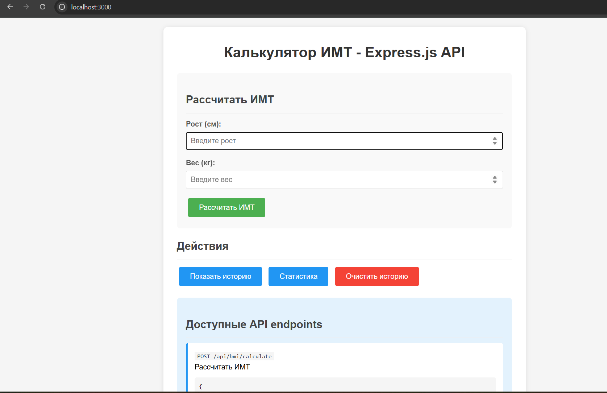
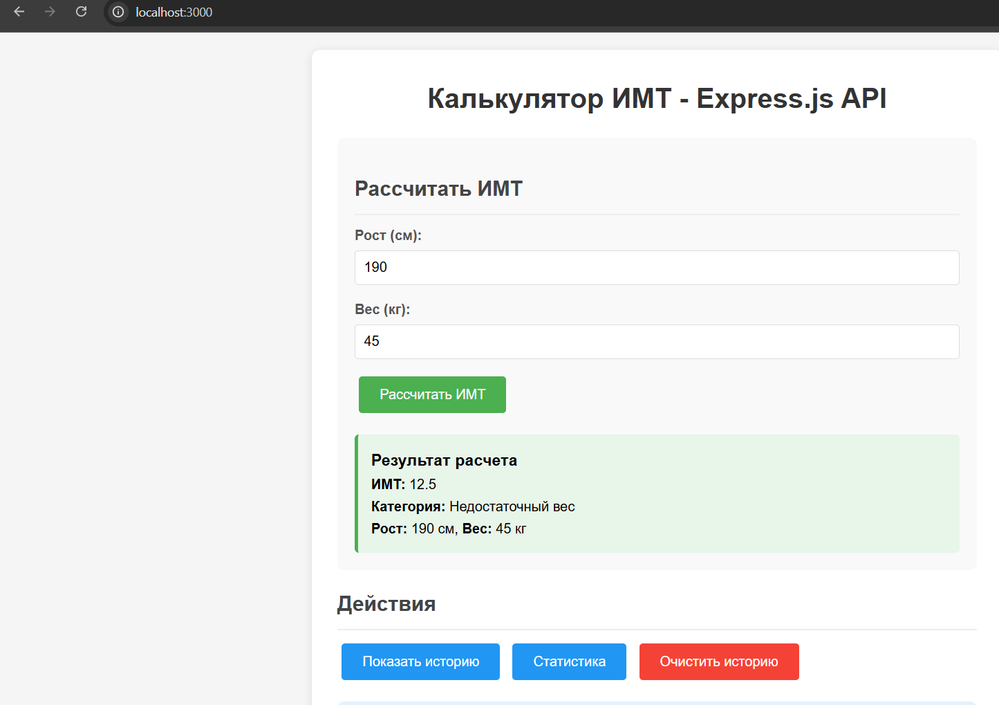
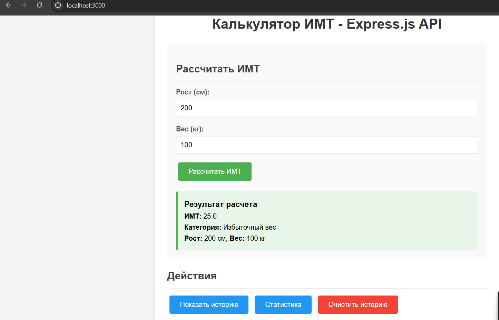
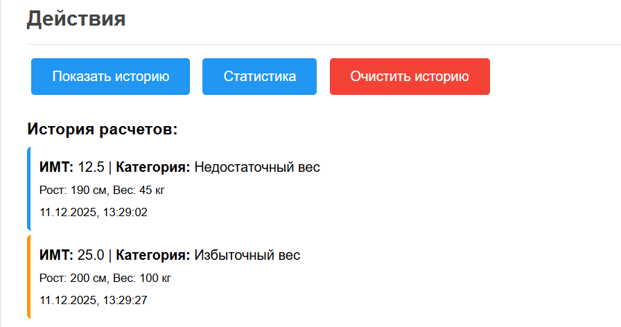
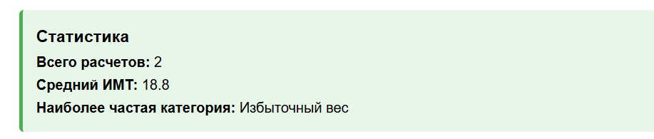
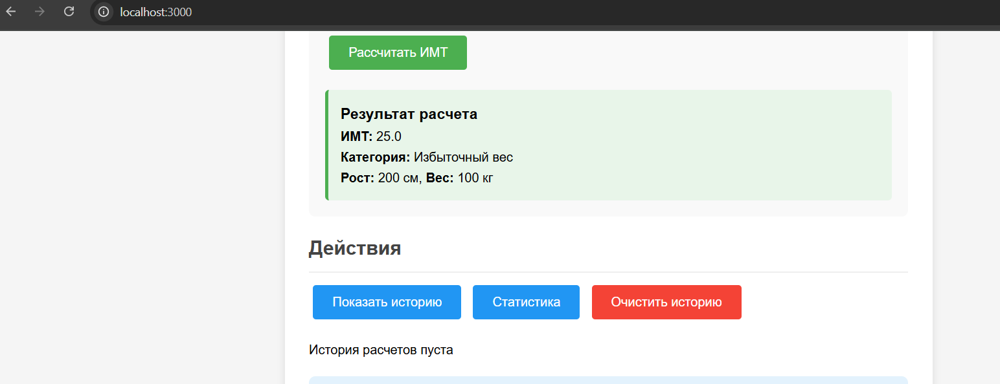

## Студент: Ильясов Дамир
## Группа: ЭФБО-08-24
## Контрольная работа №4

### Описание:   
Это простой ИМТ калькулятор
### ИМТ рассчитывается по стандартной формуле:   
ИМТ = вес (кг) / (рост (м) × рост (м))
## Категории ИМТ:
          < 18.5 - Недостаточный вес
          18.5 - 24.9 - Нормальный вес
          25 - 29.9 - Избыточный вес
          ≥ 30 - Ожирение

